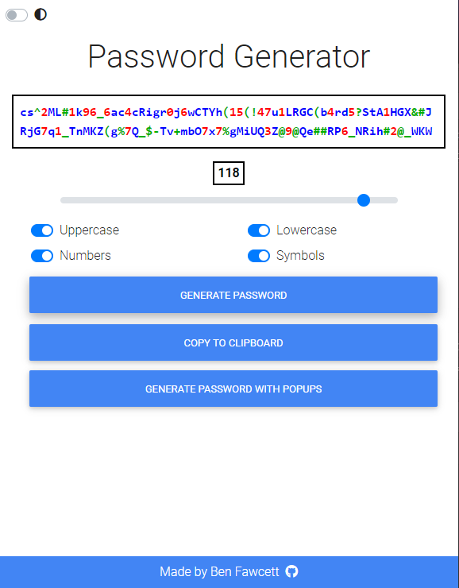
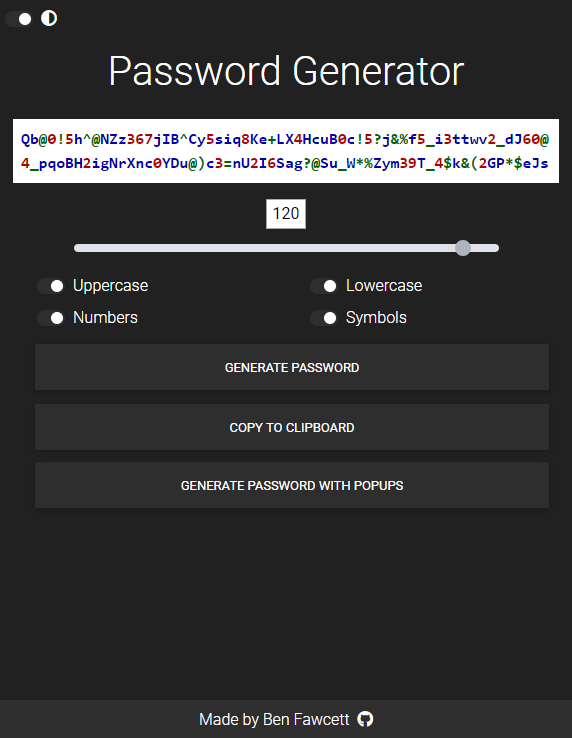

# AnotherPasswordGenerator

## [Click here to try it out](https://hexagonatron.github.io/AnotherPasswordGenerator/)

In this project I have designed an application to generate a secure random password that adheres to some constraints.

## Screenshots

### Light mode

### Dark mode

## Features

* You're able to click the 'generate password with popups' button to be prompted with a series of popups asking your password parameters
* Clicking the 'Generate Password' button will take input from the togglable swithes on the page to generate a password
* The 'Copy to Clipboard' button will copy the generated password to the clipboard
* The switch in the top left corner will toggle a dark mode on and off
* Layout is responsive so that it looks consistent across all screen sizes
* Password output characters are coloured by type (letter, number or symbol) for easier reading

## Technlogies Used

* HTML
* CSS
* Javascript
* [Bootstrap](https://getbootstrap.com/)
* [MD Bootstrap](https://mdbootstrap.com/)
* [FontAwesome](https://fontawesome.com/)

## Notes
Adapted from a [password generator](https://hexagonatron.github.io/PasswordGenerator/) I had designed previously.

## Author

Ben Fawcett